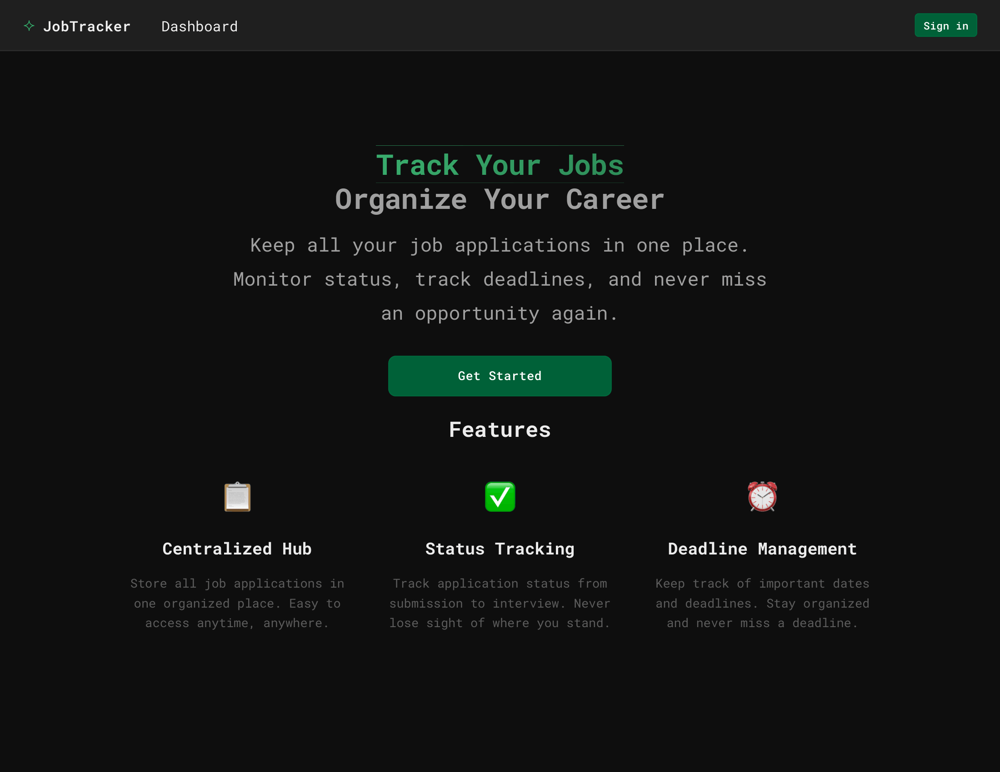
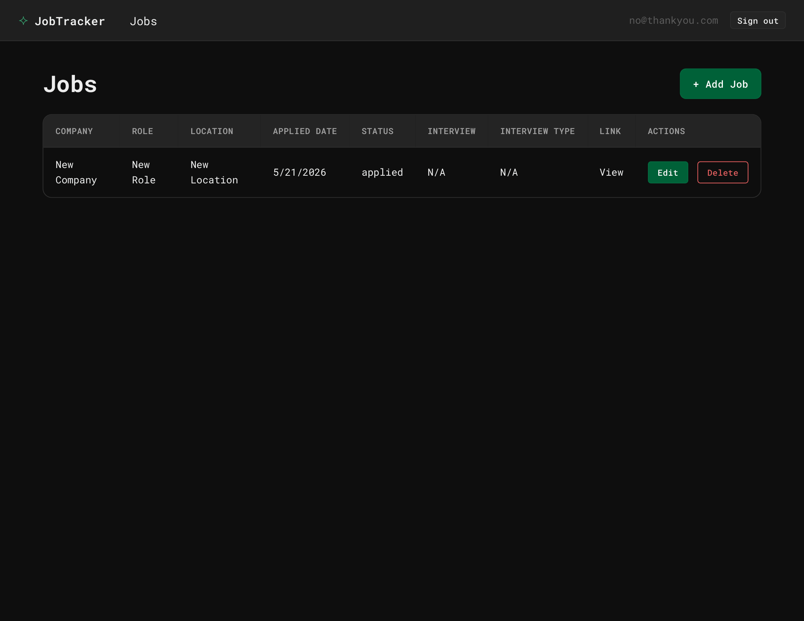
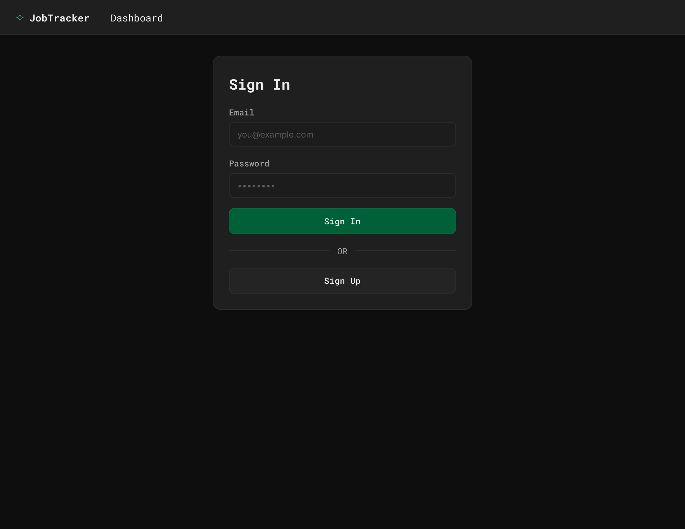

# JobTracker

A Blazor WebAssembly application for tracking and managing job applications and opportunities.

## Overview

JobTracker is a web-based job application tracker designed to help users organize, monitor, and manage their job search process. Built with Blazor WebAssembly, it provides a responsive and interactive user experience.

## Hosting

This application is hosted on **Cloudflare Pages**. You can visit it here: [https://68854a42.jobtracker-c6e.pages.dev/](https://68854a42.jobtracker-c6e.pages.dev/)

## Features

- **Dashboard**: Overview of your job tracking activity
- **Job Management**: Create, view, and manage job applications
- **Authentication**: Secure login system for user accounts
- **Responsive Design**: Works on desktop and mobile devices

## Getting Started

### Prerequisites

- .NET 10.0 SDK or later
- Visual Studio, Visual Studio Code, or another C# IDE
- A [Supabase](https://supabase.com) account and project

### Installation

1. Clone the repository:

   ```bash
   git clone <repository-url>
   cd JobTracker
   ```

2. Restore dependencies:

   ```bash
   dotnet restore
   ```

3. Build the project:

   ```bash
   dotnet build
   ```

4. Run the application:

   ```bash
   dotnet run
   ```

   The application will be available at `https://localhost:5001` (or your configured port).

### Supabase Configuration

1. Create a project on [Supabase](https://supabase.com) if you haven't already.

2. Copy `wwwroot/appsettings.example.json` to `wwwroot/appsettings.json`:

   ```bash
   cp wwwroot/appsettings.example.json wwwroot/appsettings.json
   ```

3. Update `wwwroot/appsettings.json` with your Supabase credentials:

   ```json
   {
     "Supabase": {
       "Url": "https://your-project.supabase.co",
       "Key": "your-public-key"
     }
   }
   ```

4. Get your credentials from your Supabase project:
   - **URL**: Found in Project Settings → API → URL
   - **Public Anon Key**: Found in Project Settings → API → Project API keys (anon / public)

> **Note**: `appsettings.json` is ignored by git. Use `appsettings.example.json` as a template for configuration.

## Usage

### Dashboard

- View an overview of your job search activity
- 

### Job Management

- Add new job applications
- Update application status
- Track application details
- 

### Authentication

- Log in to access your personal job tracking data
- 

---

## Technology Stack

- **Frontend**: Blazor WebAssembly
- **Language**: C#
- **Backend**: Supabase (PostgreSQL database + authentication)
- **UI Framework**: Bootstrap
- **Architecture**: Component-based with service layer

## Development

### Running in Development Mode

```bash
dotnet run --configuration Debug
```

### Building for Production

```bash
dotnet publish -c Release
```

The output will be in the `bin/Release/net10.0/publish/wwwroot` directory.

---

## Current Status

✅ **Project Status**: Complete

The core functionality is complete and fully operational. The application is ready for use.

### Future Enhancements

- [ ] Job application statistics
- [ ] Advanced filtering and search
- [ ] Export job data
- [ ] Email notifications
- [ ] Interview tracking
- [ ] Notes and reminders

**Last Updated**: May 2026
